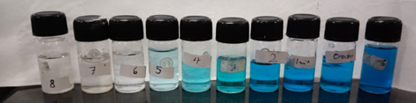
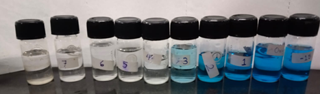
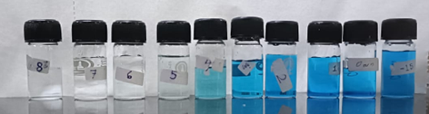
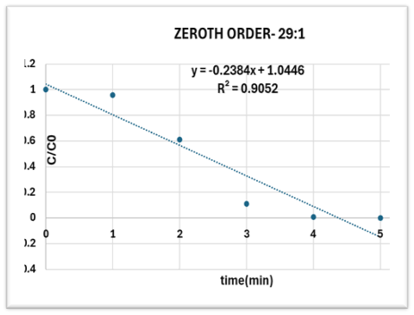
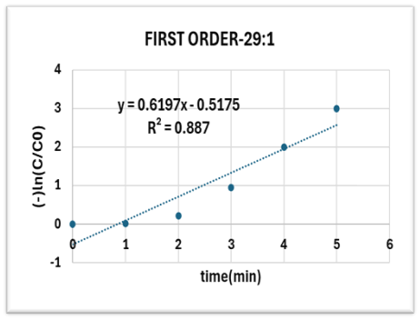
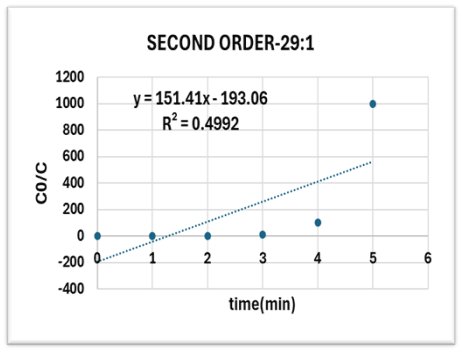

# 🧪 Photodegradation of Methylene Blue Using H₂O₂ as Promoter

**Indian Institute of Technology Kanpur (IITK)**  
Department of Chemical Engineering  
CHE331: Chemical Reaction Engineering  
**Prof. Raj Ganesh S. Pala**

**Authors:**  
Aadityaamlan Panda `220007`  
Adarsh Pal `220054`  
Akash Kumar Gupta `220095`  
Ansh Sethi `220167`

***

## 📝 **Project Overview**

**Aim:**  
Study the chemical kinetics and determine the rate law for photodegradation of Methylene Blue using an Argon light / H₂O₂ irradiation system.

**Objective:**  
Analyze reaction order via R-squared evaluation in three different experimental scenarios by varying H₂O₂ concentration.

***

## 🧬 **Theory**

- **Background**
  - Methylene blue (MB) is a widely used dye and an ecological pollutant 🏭.
  - Photodegradation aids efficient water purification and pollutant removal.
- **Role of H₂O₂ and Light**
  - H₂O₂ generates hydroxyl radicals (- OH) under light:  
    `H₂O₂ + hν → 2- OH`
  - Light acts in direct photolysis of MB and activates H₂O₂.
- **Degradation Mechanism**
  - Excitation of MB  
  - Generation and attack of - OH radicals on MB  
  - Progression to safer products  
- **Study Goals**
  - Efficient MB degradation
  - Understanding influencer variables (MB, H₂O₂ concentration, illumination)
  - Mapping optimal reaction conditions
  - Applications in wastewater treatment

***

## 🧪 **Materials & Equipment**

- **Chemicals Needed**
  - Distilled water
  - Methylene Blue (solid dye)
  - H₂O₂ (aqueous)
  - Acetone
  - Soap solution
- **Apparatus**
  - UV Spectrometer
  - Photoreactor
  - Argon Lamp
  - Magnetic Stirrer
  - Glassware (Flasks, Test Tubes, Graduated Cylinders)

***

## ⚗️ **Experimental Procedure**

1. **Glassware Preparation:**  
   Washed and oven-dried glassware at 90°C for 5 minutes  
2. **Stock Solution:**  
   10 mg MB in 1 L distilled water (10 ppm), stirred and protected from light  
3. **Calibrations:**  
   Absorbance vs. Wavelength calibration for MB using UV spectrometer  
4. **Preparation of mixtures:**  
   Various MB:H₂O₂ ratios to examine concentration effect  
5. **Degradation Experiments:**  
   Reaction performed with Argon lamp, magnetic stirring, and sample analysis every minute  
6. **Measurement & Analysis:**  
   Spectrophotometric data used for kinetic studies

> 📺 [_Watch Experiment Video_](https://youtube.com/watch?v=NDle3TmiLoA&feature=shared)

***

## 🔬 **Equipment Description**

### Photocatalytic Reactor
- Light source: UV or visible lamps  
- Catalyst: e.g., TiO₂  
- Chamber: Enclosed for reaction  
- Flow systems, temperature control, catalyst mounting

### UV Spectroscopy
- Light source, monochromator, sample holder, detector, data system, cuvette

***

## 👀 **Observation & Sample Images**

Initial rapid MB degradation at high H₂O₂ concentration.  
Sample images show color change over time.

***

## 📊 **Calculation & Plots**

*29 MB solution:1 H2O2 solution*

- Zeroth Order: Ct/C0 vs time
- First Order: ln(Ct/C0) vs time
- Second Order: 1/(Ct/C0) vs time

***

## 📃 **Results**

| MB:H₂O₂ Ratio | Best Fit Order | R²      | k (rate constant) |
|---------------|----------------|---------|-------------------|
| 10:1 H₂O₂     | Zero (highest) | 0.9052  | 2.02 L/min        |
| 29:1 H₂O₂     | First (highest)| 0.9166  | 0.20 min⁻¹        |
| Without H₂O₂  | Zero (highest) | 0.9329  | 2.23 L/min        |

> **Key Finding:** Reaction order shifts from first order to zero order as H₂O₂ concentration decreases.

***

## ⚠️ **Sources of Error**

- Inaccurate MB/H₂O₂ measurements  
- Fitting/calibration error  
- Uneven light exposure or poor mixing  

***

## 🎇 **Conclusions**

- Photocatalytic MB degradation order varies with H₂O₂ concentration.
- High H₂O₂ ➔ First order kinetics; Lower/none ➔ Zero order.
- Light alone can drive slower, zero-order degradation.
- Direct application in environmentally friendly water treatment.

***

## 🌱 **Applications**

- **Wastewater treatment**: Insights for dye removal optimization
- **Process control**: Enables peroxide-free catalytic pathways
- **Design flexibility**: Systems tailored for H₂O₂ dosing and minimal chemical use

***

## 🤝 **Contributions**

- Research & Experiment: All authors
- Experimental Set-up: Akash, Aadityaamlan, Adarsh
- Data Analysis & Plots: Ansh, Aadityaamlan, Adarsh
- Calculations: Akash, Ansh, Aadityaamlan
- Report Writing, Observations, Video: All

***
